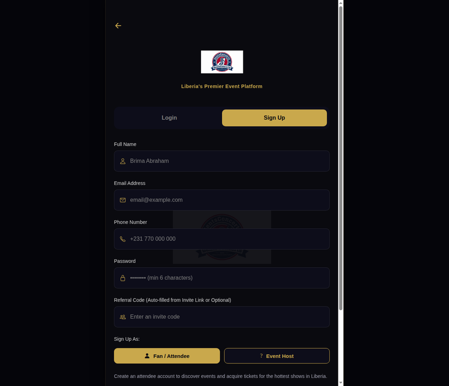
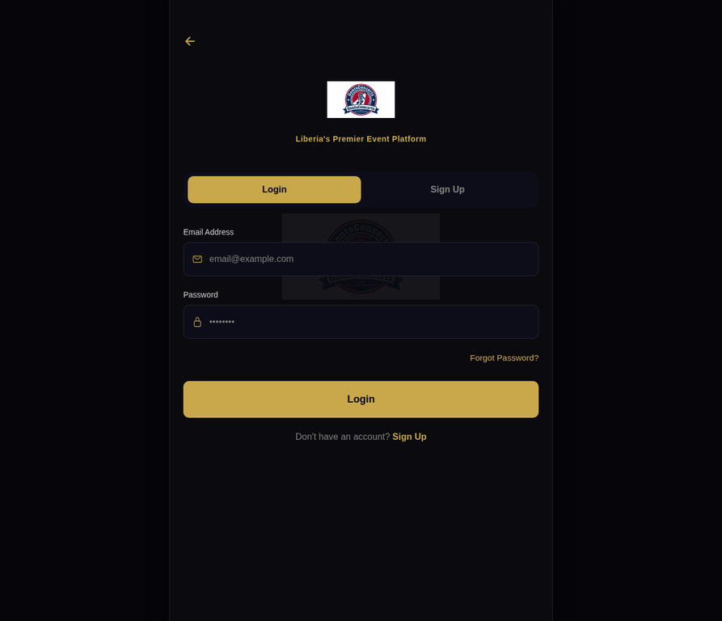
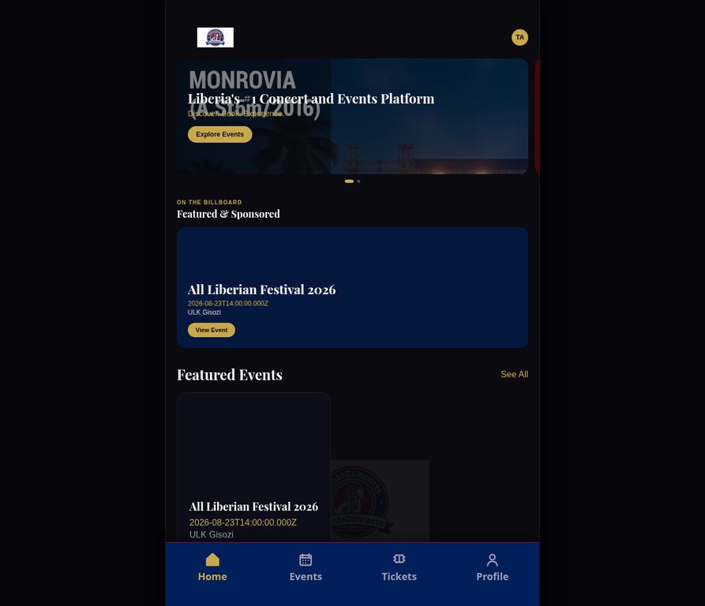
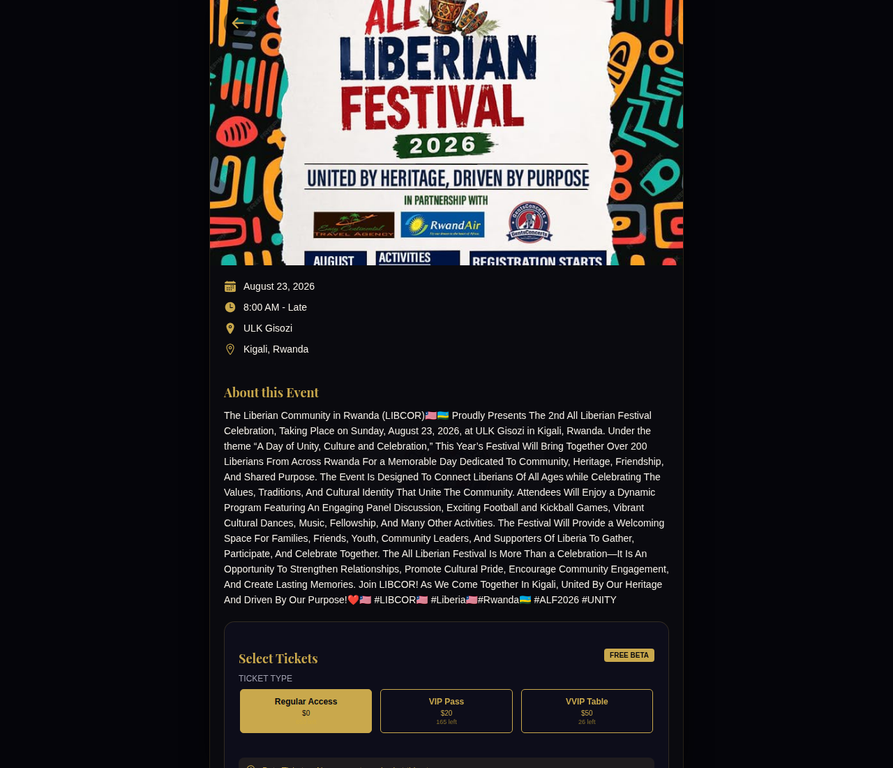
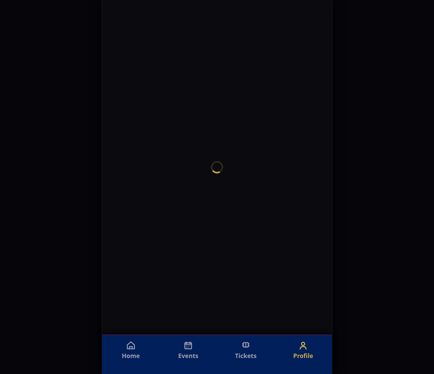

# Social Media Kit: GentsConcerts x LIBCOR Partnership

**Announcement Post (Short & Engaging)**

We are proud to announce that GentsConcerts has officially partnered with the Liberian Community in Rwanda (LIBCOR) for the **2nd All Liberian Festival Celebration**! Join us on Sunday, August 23, 2026, at ULK Gisozi in Kigali for a vibrant day of cultural performances, panel discussions, sports, and community fellowship. **Please note that this exclusive event is only available for users currently residing in Rwanda.**

Securing your attendance is entirely digital, fast, and secure. Attendees residing in Rwanda can claim their free Beta tickets instantly through our platform, receiving a unique digital pass with a QR code for seamless paperless entry at the festival gates.

Head over to [gentsconcerts.netlify.app](https://gentsconcerts.netlify.app/) right now to claim your ticket. Follow our step-by-step navigational guide below to sign up, log in, and secure your spot at Liberia's premier celebration!

#LIBCOR #Liberia #Rwanda #ALF2026 #GentsConcerts #Unity

---

# Navigational Guide: Step-by-Step Ticketing

### **Step 1: Access & Sign Up**
Visit [gentsconcerts.netlify.app](https://gentsconcerts.netlify.app/) and tap **"Sign Up"**. Choose **"Fan / Attendee"** and enter your details.

### **Step 2: Log In**
Once registered, log in with your email and password to access your personalized dashboard.

### **Step 3: Find the Festival**
On the Home screen, locate the **All Liberian Festival 2026** featured banner or event card.

### **Step 4: View Details & Select Ticket**
Tap the event to see full details, venue schedule, and ticket options. Select your **Regular Access** ticket.

### **Step 5: Secure Your Ticket**
Confirm your claim to generate your digital QR pass instantly. Present this at the gate on August 23rd!

